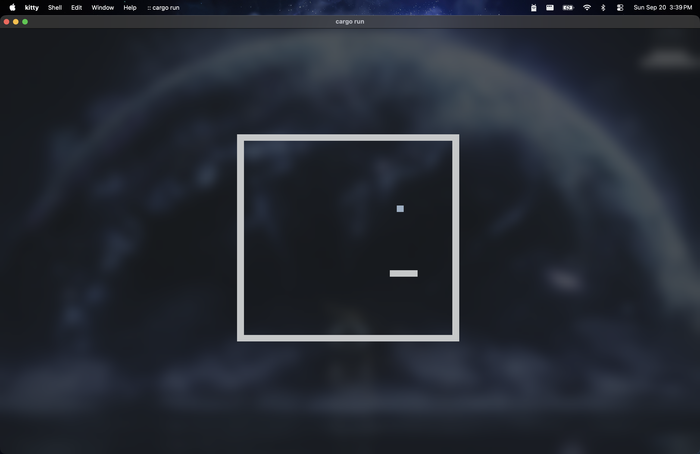
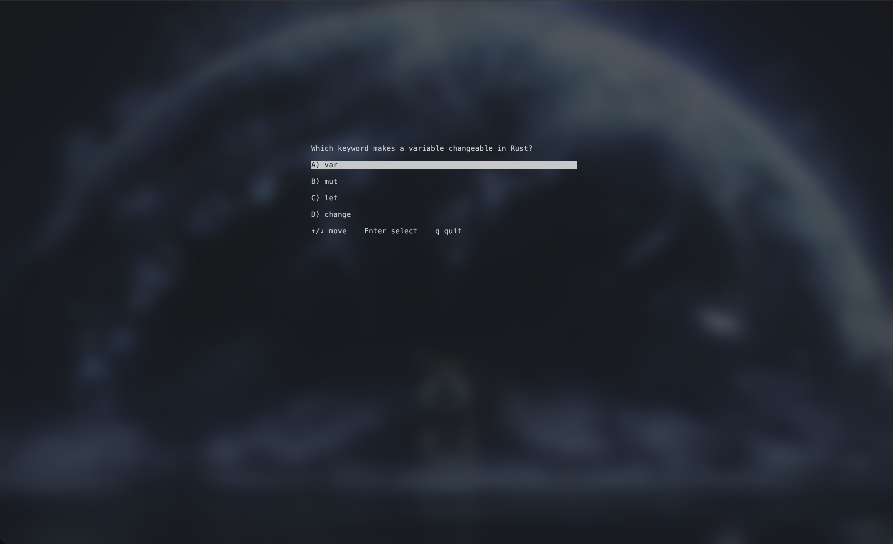

# Book-Snake
Book-Snake is a 100% rust built native terminal game that was made for the `Fall-2026 GVSU Computing Club Game Jam` with the theme `Disguise`. This game is secretly a learning tool **"Disguised"** as a classic snake game.

## Quick Start

1. Install Rust with rustup (https://rustup.rs) according to what OS you have.
2. Then clone this repo in the terminal and change into the directory: 
```
git clone https://github.com/Calebb2202/Book-Snake.git;
cd Book-Snake
```
3. Edit `quesitons.json` to whatever your studying for (see `Importing Questions` section)
4. Then run `cargo run` in the terminal
```
cargo run
```
**Continued Usage:** All you have to do to re-enter the game is run `cargo run` again making sure to having a terminal in the project directory
 
## Importing Questions

To import questions from a study guide pdf a professor or teacher assigned do the following:

1. Go to your favorite LLM website and import the study guide pdf file or just paste the whole text (your class notes and professor slides would also probably work!)
2. paste this exact prompt:
```
I'm making a multiple-choice quiz from the attached study guide (a PDF or pasted text). Read all of it, then write around 20 questions that test its most important facts and concepts.

Reply with ONLY one code block containing valid JSON. No text before or after it, and no explanations. The JSON must be an array of objects, each with exactly these fields:

- "prompt": the question, as a string
- "answers": an array of exactly 4 answer strings
- "answer_index": the position of the correct answer in "answers", as a number from 0 to 3

Format example (for format only, do not reuse it):

[
  {
    "prompt": "Which keyword makes a variable changeable in Rust?",
    "answers": ["var", "mut", "let", "change"],
    "answer_index": 1
  }
]

Rules:
1. Randomize where the correct answer goes. Before writing, plan an answer_index for every question so that 0, 1, 2, and 3 each appear about equally often, and no index appears more than twice in a row. The correct answer must not usually be in the same position.
2. Each question has exactly one correct answer, and the 3 wrong answers must be plausible, not obviously silly.
3. Do not use "all of the above", "none of the above", or "both A and B". The answer order is fixed, so answers must never refer to each other.
4. Do not put letters or numbers like "A)" or "1." in front of the answers. The game adds them.
5. Every question must make sense on its own. Never say "according to the text" or "in the study guide".
6. Keep each question under 200 characters and each answer under 80 characters.
7. The JSON must be strictly valid: double quotes only, no trailing commas, no comments, and any quote marks inside a string escaped as \".
8. Use only information from the study guide. If the file is unreadable or empty, say so instead of inventing questions.
```
3. Paste the LLMs response into the `questions.json` file inside the project directory and save the file.
4. Now the questions are loaded in and you can run `cargo run` to start playing (you may want to delete questions that you continue to get correctso you can study the ones you struggle with more).

## Project Photos

**Snake Game**



**Question Menu**

